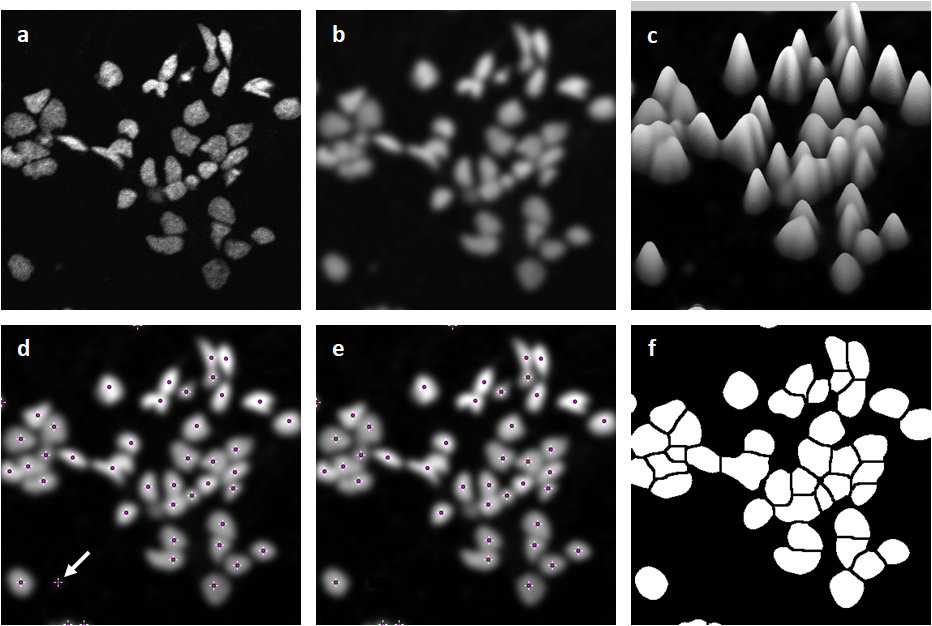
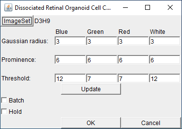
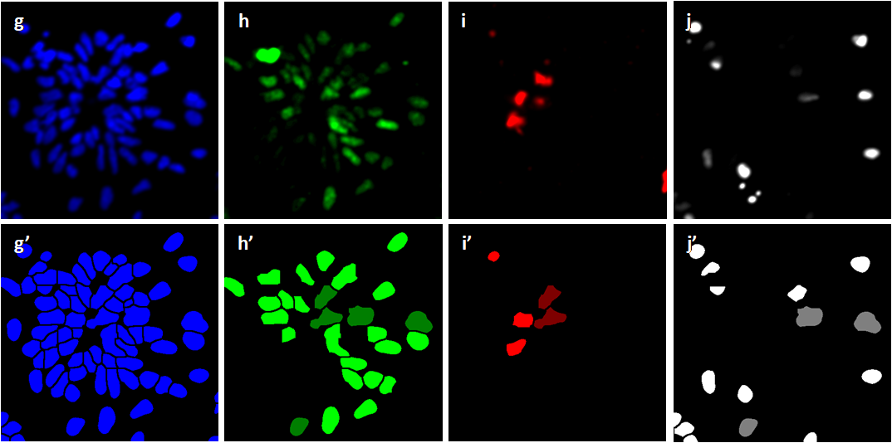
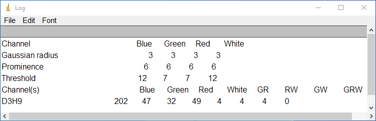

# ImageJ Plugin RO Cell Counter

Plugin RO Cell Counter was written to count dissociated retinal organoid cells imaged by confocal microscope, and it is based on the segmentation of the cells in the image-set. 

**Principle:**

Some of the dissociated retinal organoid cells in the image-set appear as clumps (a), thresholding followed by doing watershed does not segment the cells. However the cells can be separated individually by checking their peaks. First the image is smoothed (b) using a Gaussian filter, and the peaks of the cells as shown in the surface plot (c) are picked in (d). A peak is picked if its prominence is above the set prominence value. Choosing the right filter and prominence parameters plugin RO Cell Counter can pick one peak on a cell for almost all the cells.       

Peaks in the background (arrow pointed in (d)) may also be picked by the plugin, but the cell and background peaks are differentiated by thresholding (e). Segmented cells are shown in (f).

**Parameters:**

Start plugin RO Cell Counter, the pluign prompts to load an image-set, smooths the image-set and picks the peaks using the default Gaussian filter radius and prominence values 3 and 6. The thresholds to differentiate cell and background peaks are auto-detected. The plugin allows tweaking the filter radius, prominence and threshold values by modifying them followed by clicking on button "Update". Button "Image Set" loads an image-set and starts cell counting just like the plugin's launching. The plugin can also do "Batch" cell counting - counting for all the image-sets in the same folder of the current image-set, with the option to "Hold" the current paramenters. 

**Example:**

Here is an example of cell counting by plugin RO Cell Counter. The image-set of dissociated retinal organoid cells include 4 channels of blue, green, red and white that represent all the cells (g), cell proliferation (h), cell death (i) and grown ganglion cells (j) respectively, and below are the segmented images (g’, h’, i’ and j’). The plugin counts the cells in each channel (Blue, Green, Red and White) and the cells co-localized among the channels of green, red and white as GR, RW, GW and GRW. The co-localized cells are colored in darker green, red and white in the segmented images. 
